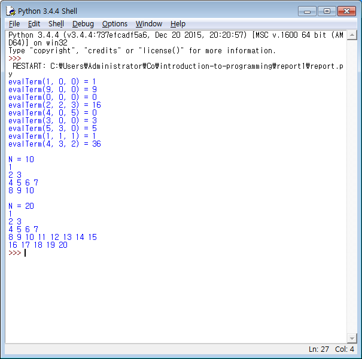

REPORT 1
--------

2016-04-02 00:44 (오전) 에 사용되고 있던 Homework.hwp 에 명시된 내용대로 Python 구현체와 실행 절차가 작성되어 있습니다.

# 구성
1. procedures.md

  실행 절차가 명시되어 있습니다.

2. report.py

  명세서의 Python 구현체입니다.

# 실행 결과

#### 작성자: 컴퓨터 공학부 201601560 권혁모